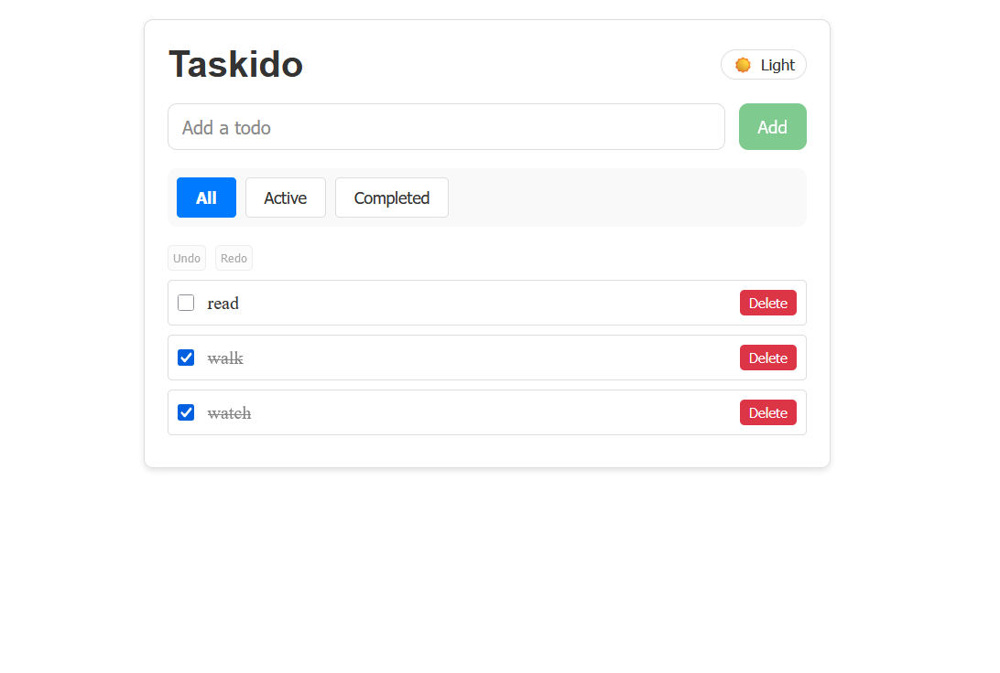
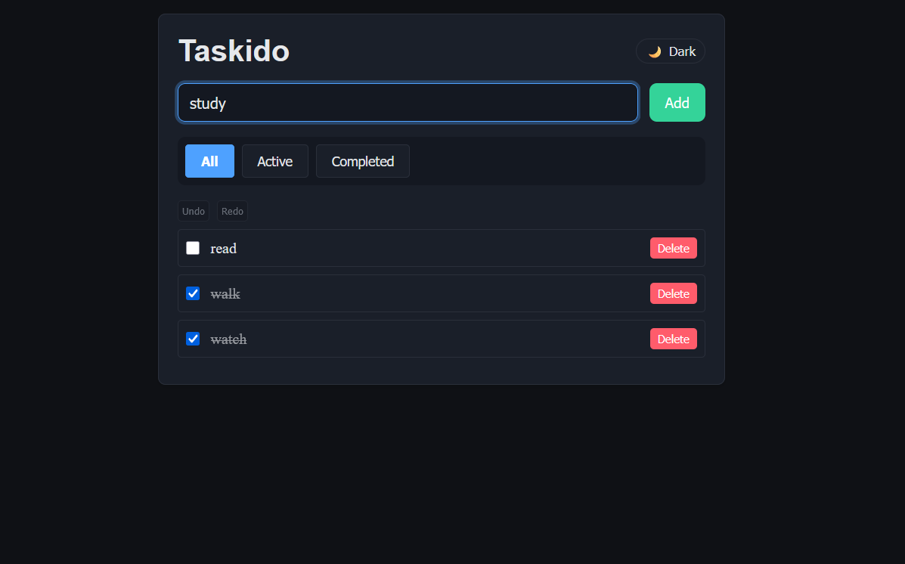

# Taskido

A simple todo-list app to manage tasks efficiently.

|  |
| :----------------------------------------: |
|        _Image 1 — light mode view._        |

|  |
| :---------------------------------------: |
|        _Image 2 — dark mode view._        |

---

## 📚 Overview

**Taskido** is a single page app built with **React.js**.

The project is deployed to a Vercel website [(Click here)](https://taskido-indol.vercel.app/) for you to test the app right away!

---

## ✨ Features

- **Filtering**: View tasks by _All_, _Active_, or _Completed_ status.
- **Drag-and-Drop Reordering**: Reorder tasks using drag-and-drop.
- **Local Storage Persistence**: Save tasks across browser sessions.
- **Undo/Redo**: Revert or redo changes.
- **Dark Mode**: Toggle between light and dark themes.

---

## 🛠️ Tech Stack

- **Frontend:** React.js v.19
- **Styling:** CSS (+ CSS Modules)
- **Library (for undo/redo)** use-immer
- **Data Storage:** localStorage
- **Linting & Formatting:** ESLint, Prettier
- **Package Manager:** npm

---

## 🚀 Getting Started

1. **Clone the repository:**

    ```bash
    git clone https://github.com/Wilfried-O/taskido.git
    ```

2. **Navigate to the project directory:**

    ```bash
    cd taskido
    ```

3. **Install dependencies:**

    ```bash
    npm install
    ```

4. **Start the development server:**

    ```bash
    npm start
    ```

5. **Open in your browser:**  
   [http://localhost:3000](http://localhost:3000)

---

## 📋 Project Status

- ✅ **Feature complete:**
    - Core app features: Add, delete todo and mark As Completed
    - Filter: view by completion status
    - Drag & Drop: modify todo priority
    - Undo/Redo: revert changes
    - Local Storage persistence: preserving current todo list and theme

- ⚙️ **Work in Progress:**
    - UI improvement: add icons and logo, polish the look (e.g. spacing and alignment)
    - Maintenance:
        - refactoring for clarity (e.g. consider useReducer Hook for better logic exposure)
        - improve accessibility (aria)

### 🧭 Next Steps

- Responsive design: make the app mobile-friendly
- Modification of todo: Add text edition
- Support French language

---

## 🤖 AI Assistance

This project uses AI assistance for planning, coding, and debugging.  
All code is reviewed and fully understood by the author to ensure quality, clarity, and safety.

---

## 📄 License

This project is licensed under the **MIT License**.
